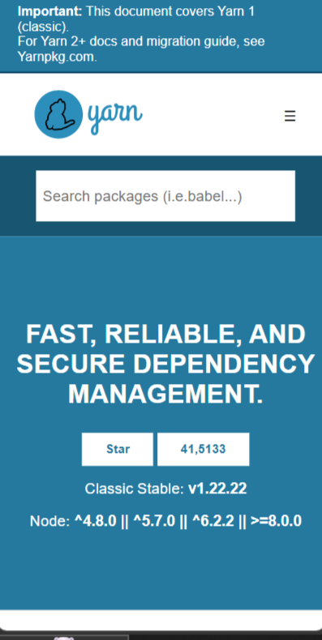
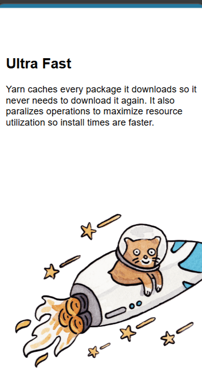
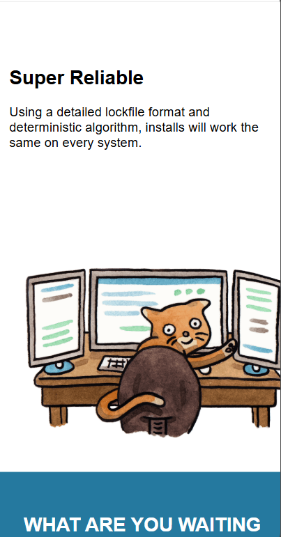
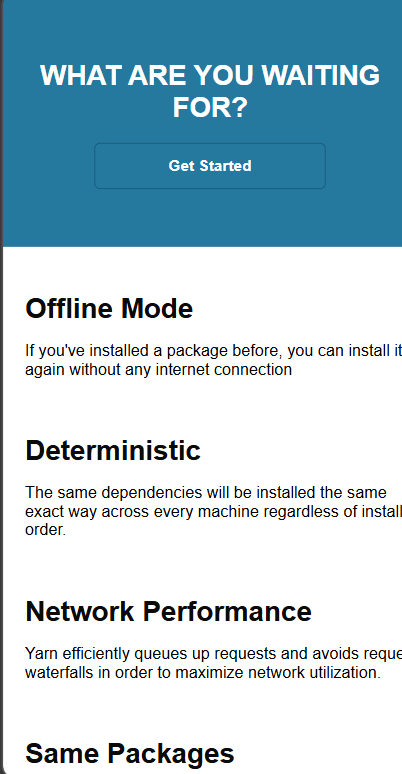
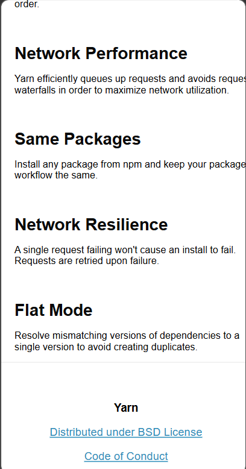

# Yarn-mobile-Clone
A mobile-first layout project built using HTML and CSS to practice responsive design, Flexbox, and modern UI structuring. The project replicates a clean and scalable interface inspired by classic dependency management documentation layouts.

## 📌 Project Overview

This project focuses on:

- Responsive layouts using Flexbox  
- Mobile-first design principles  
- Structured UI sections  
- Clean and maintainable CSS  
- Real-world web layout practices

The layout contains multiple sections such as hero banners, feature highlights, call-to-action blocks, and a footer — all optimized for small screens and readability.

## 🎨 Inspiration

The design structure is inspired by modern documentation-style layouts, similar to dependency management and developer documentation sites. It demonstrates how content can be structured for usability and clarity.

## 📂 Project Structure

```
project-folder/
│
├── index.html
└── style.css
└── assets
└── docs/
    ├── image1.png
    └── image2.png
    └── image3.png
    └── image4.png
    └── image5.png
    └── image6.png
```

---
## 🖼️ Screenshots

Here are project screenshots:


 
 
 
 
| 

---

## 🧠 Technologies Used

- HTML5  
- CSS3  
- Flexbox  
- Mobile-first design

No external frameworks or JavaScript were used — keeping the project lightweight and focused on layout design.

## ✨ Features

- Mobile-friendly layout  
- Structured content sections  
- Responsive images  
- Clean spacing and alignment  
- Call-to-action area  
- Footer section

## 📖 What I Learned

This project helped in mastering:

- Flexbox layouts  
- Content alignment  
- Responsive design strategies  
- Box model usage  
- UI component structuring

## 🚀 How to Run

1. Download or clone the project  
2. Open `index.html` in a browser  
3. View the responsive layout


